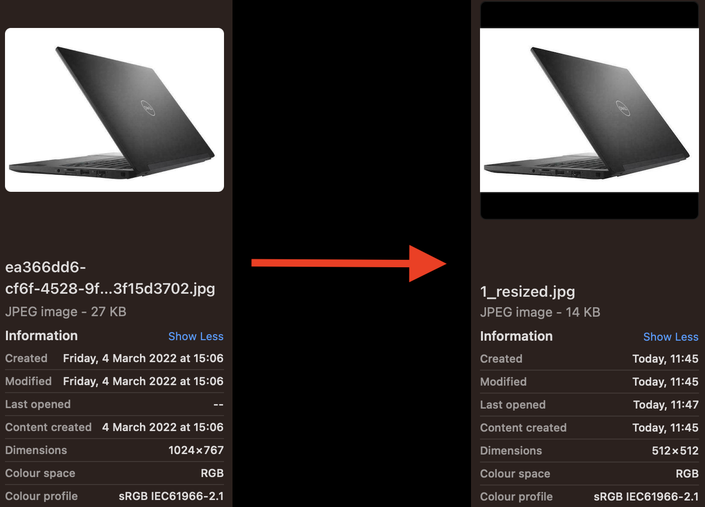

# Facebook Marketplace Recommendation Ranking System (AiCore)

Project that I'm working on as a part of my 'Data and AI' training at [AiCore](https://www.theaicore.com/).

> Please note that this project, like all projects completed at AiCore, is *not* tutorial-based. All the code in this repo was written by myself, following simple guidelines provided by the instructors.


In the Facebook Marketplace Search Ranking project, we are asked to develop and train a multimodal model that accepts images and text. The output of the model will generate embedding vectors that are helpful to make recommendations to buyers using their demographic information. 
Once the model is trained, we will have to deploy it by creating an API using FastAPI, containerising it using Docker, and uploading it to an EC2 instance. The API will contain all the models that we create and train, so any new request can be processed to make predictions on the cloud. To ensure that the model can be easily modified without building a new image again, the files corresponding to each model will be bound to the Docker image, so it allows us to update the models with retrained models even after deploying them.

## 👀 Project overview 👀

- process and clean text and image datasets;
- design and train a multimodal model that combines images and text to generate embedding vectors to create a search index using Pytorch;
- create a pipeline to systematically clean new data and upsert it into a database;
- develop an API that encapsulates the models using FastAPI;
- deploy a container with the API using docker compose.

## Technologies

## Milestones 1-2


The first and second milestones of the project consist in setting up GitHub, creating a repository for the project, an AWS account, and going over the technology that we are asked to reproduce.

A nice introductory video that I encourage everyone to watch is available on the [AiCore YouTube Channel](https://youtu.be/1Z5V2VrHTTA).

## Milestone 3

In milestone 3, we're required to clean both the tabular and the image datasets, which are made available to us as EC2 instances on AWS.

### Tabular data cleaning

The tabular dataset contains information about the listing, including its price, location, and description. We are required to create a file named `clean_tabular_data.py` within our repository, which has to be populated with code to clean the tabular dataset. The dataset was in a EC2 instance on AWS, which is accessed by ssh from the local machine.

As per usual, I started exploring the data using a jupyter notebook first, `clean_tabular_data.ipynb`, which is located within the `tabular_data/` directory. The pandas frame showed that the main cleaning required in this task was to convert the prices into a numerical format, as all entries were preceded by the pound sign (£), as in colomn 3 here below, and some entries included a comma (,), as illustrated by column 84.


Additionally, some rows contained at least one NaN, as in the image below. These rows will have to be deleted from the file as they constitute incomplete data.


The python file was therefore designed to include two functions, one to open the tabular data using pandas (`obtain_tabular_data()`), and one to do the necessary cleaning (`clean_price_column()`). The former implements code to open the .cvs file containing the dataset, and utilises the `.dropna()` method to delete all rows including at least one case of missing information. Its arguments, in the number of two, are the filepath and the line separator, which is by default a comma in .csv files.

The `clean_price_column()` function assigns the `['price']` column of the original pandas data frame to the `price_column` variable, and then includes the steps that follow:

```python3
price_column = price_column.str.strip('£')
price_column = price_column.replace(',','', regex=True) # commas need to go to convert price string to float
price_column = price_column.astype('float64')
```

These include the necessary operations to convert a string column into a column of floats, i.e., deletion of the pound sign (£), deletion of commas if present, and type conversion from string to float64. That the conversion has been successful can be verified by calling the .info() method on the panda frame, which prints the following:

<p align="center">

</p>

### Image data cleaning

The image dataset comprises of a total of 12668 items. These do not have the same size, nor the same number of channels. We were therefore required to write code to make sure all images were consistent along these two dimensions.

The `clean_images.py`file in the repository contains the code I wrote to clean the image dataset. This implements a pipeline that applies the necessary cleaning to the image dataset by defining a function called `clean_image_data`. The function takes two arguments: `final_size` (int), the size value in pixels of the resized image, and `image` (image), the image to be resized.

```python3
def clean_image_data(final_size, image):
    size = image.size
    ratio = float(final_size) / max(size)
    new_image_size = tuple([int(x*ratio) for x in size])
    image = image.resize(new_image_size, Image.Resampling.LANCZOS)
    new_image = Image.new("RGB", (final_size, final_size))
    new_image.paste(image, ((final_size-new_image_size[0])//2, (final_size-new_image_size[1])//2))
```

The ratio, assigned to the `ratio` variable is the final size of the image over the max size, converted into a float, while the `new_image_size` is a tuple created using a list comprehension that takes each x in the image `size` (calculated using the built-in `.size` method), multiplies it by the ratio. For the actual resizing, I used `Resampling.LANCZOS` instead of the suggested `ANTIALIAS` as the terminal signalled that the latter will be deprecated in Pillow 10. The function returns the resized image, which is assigned to the variable `new_image`.

```python3
return new_image
```

A docstring has been added to the function, as per python OOP best practices.

The logic behind the file is quite straightforward, and is implemented in the `if __name__ == '__main__'` function. 

It should take in a filepath to the folder which contains the images, then clean them and save them into a new folder called "cleaned_images".

```python3
new_path = "image_dataset/cleaned_images/"
if not os.path.exists(new_path):
    os.mkdir(new_path)
```

```python3
for n, item in enumerate(dirs[:5], 1): # index has to be changed to limit/increase number of processed images
    try:
        image = Image.open(path + item)
        new_image = clean_image_data(final_size, image)
        new_image.save(f'{new_path}{n}_resized.jpg')
    except:
        print(f'Resizing failed for {item}.')
```

A try-except statement has been added to make sure the program does not crash if a file in the `raw_images` folder is not recognised as an image.

The result of the resizing can be seen in the image below. Please note both the change in file name (from a quite complex and random one to `1_resized.png`) and in file size (from 1024x767 to 512x512). The file size has been chosen after a random exploratory analysis of the file sizes in the complete dataset.



> Little curiosity: My 6-year-old daughter has developed an interest in computing lately, and `resizing.png` is the first image she's ever named.